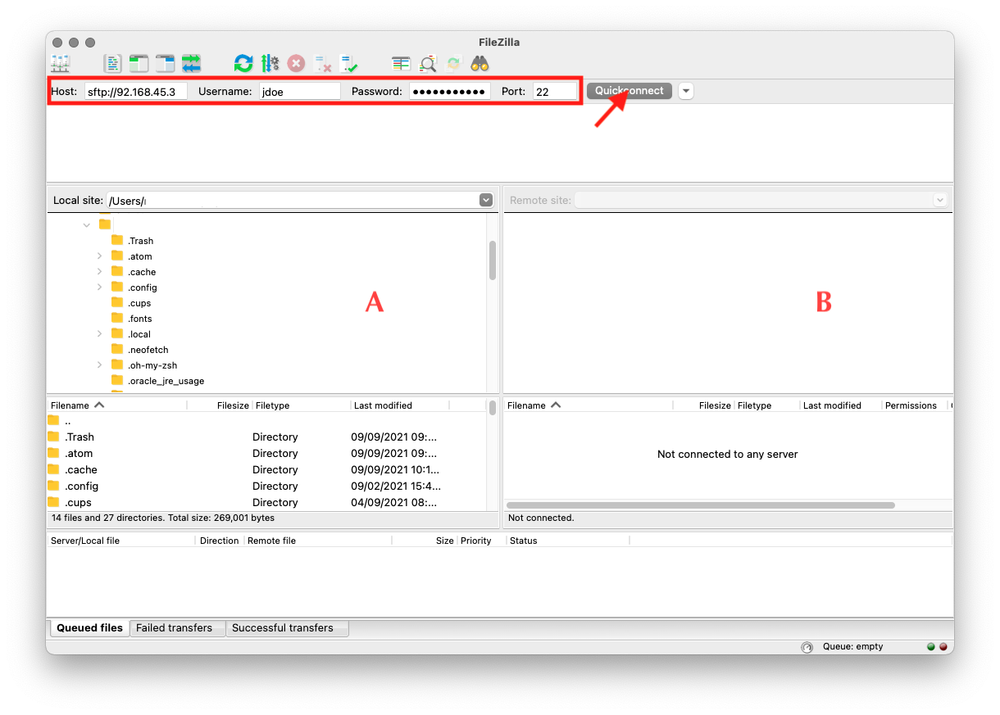
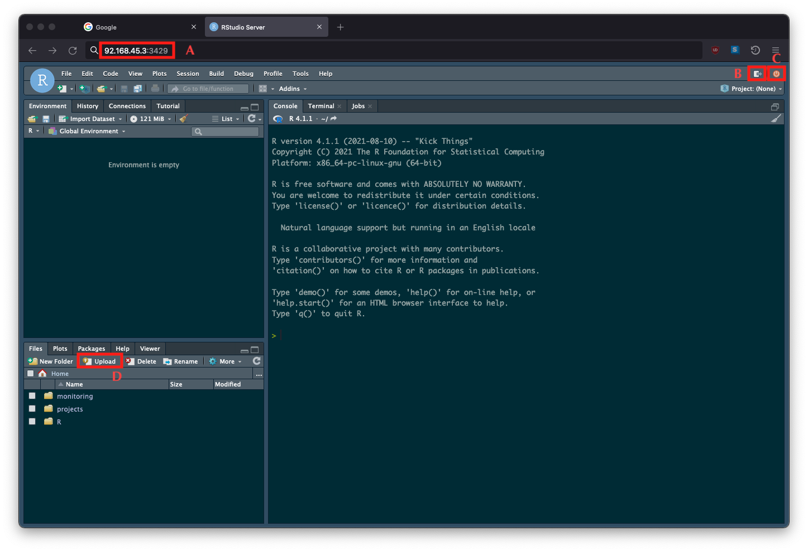

\newpage


Lorem ipsum dolor sit amet, consectetur adipisicing elit, sed do eiusmod tempor incididunt ut labore et dolore magna aliqua. Ut enim ad minim veniam, quis nostrud exercitation ullamco laboris nisi ut aliquip ex ea commodo consequat. Duis aute irure dolor in reprehenderit in voluptate velit esse cillum dolore eu fugiat nulla pariatur. Excepteur sint occaecat cupidatat non proident, sunt in culpa qui officia deserunt mollit anim id est laborum.


- htop
- Slack
- New softwares
- Directory access


**Important:** Rossinante is **not a storage server**. Its 6 TB storage are shared
among all users. You can store large datasets on your personal space to run yours
analyses. But once you've finished, please remove your data.


\vspace{0.75cm}

# 1. First connexion

\vspace{0.25cm}

## 1.1. Secure Shell

\vspace{0.25cm}


The first connection to the Rossinante server must be done using the **SSH**
(Secure SHell) protocol. This protocol is a cryptographic network protocol
that allows you to securely access a remote computer over an unsecured
network.

For this tutorial, let's say your name is `Jane DOE`, your user name on your
laptop is `jane`, your laptop name is `laptop`, your user name on Rossinante is
`jdoe`, the public IP[^1] of Rossinante is `92.168.45.3`, and the port of the
SSH server is `22`.

To open an SSH connection on Unix-based OS (macOS and Linux)[^2], open a terminal
session and run:

[^1]: When you are inside the CESAB, you can use the local IP address of the
server.

[^2]: On Windows, you'll need to install the software
[Putty](https://www.chiark.greenend.org.uk/~sgtatham/putty/).


```sh
# SSH connection to Rossinante ----
jane@laptop:~$ ssh -p 22 jdoe@92.168.45.3
```

You'll be asked to change your password. Enter the old password and set your new
password (twice).

Then, your prompt will look like:

```sh
jdoe@rossinante:~$
```

This means that you are now connected to Rossinante under the user name `jdoe`. 
You can check your current directory with the command `pwd`:

```sh
# Print working (current) directory ----
jdoe@rossinante:~$ pwd
## /home/jdoe
```

To stop the SSH connection, use the command `exit` (or `logout`):

```sh
jdoe@rossinante:~$ exit
## Connection to 92.168.45.3 closed.
```


\vspace{0.50cm}

## 1.2. SSH configuration file

\vspace{0.25cm}


It can be painful to remember the IP address and the SSH port of Rossinante,
especially if you use several servers. Fortunately you can store Rossinante
credentials (except your password) and SSH connection information in a special
file located on **your laptop** (not in the server): `~/.ssh/config`.

To create this `config` file, follow these steps:

```sh
# Navigate to your home directory (symbolized by ~) ----
jane@laptop:~$ cd ~

# Create a new hidden folder ----
jane@laptop:~$ mkdir .ssh

# Change folder permissions ----
# (only Jane can read, write, and execute this folder) ----
jane@laptop:~$ chmod 700 .ssh

# Create the (empty) SSH config file ----
jane@laptop:~$ touch .ssh/config

# Change config file permissions ----
# (only Jane can read and write this file) ----
jane@laptop:~$ chmod 600 ~/.ssh/config

# Open the SSH config file with the CLI editor nano ----
jane@laptop:~$ nano ~/.ssh/config
```

Now add the follow lines in the SSH Config file:

```sh
## Host rossinante
##     HostName 92.168.45.3
##     Port 22
##     User jdoe
```

To save changes press `CTRL + X` and `Y` (or `O` if the language of your system is
French) and press `Enter`.

\vspace{0.25cm}

You can now connect to Rossinante as follow:

```sh
jane@laptop:~$ ssh rossinante
```


\vspace{0.50cm}

## 1.3. Generating SSH keys

\vspace{0.25cm}


Though SSH supports password-based authentication, it is generally recommended
that you use SSH keys instead. SSH keys are a more secure method of logging into
an SSH server, because they are not vulnerable to common brute-force password
hacking attacks. Generating an SSH key pair creates two long strings of 
characters: a public and a private key. You can place the public key on any 
server, and then connect to the server using an SSH client that has access to 
the private key.

Let's create a new SSH keys pair using the cryptosystem `RSA` and a key size of
`4096` bits.

```sh
# Create a new SSH key pair ----
ssh-keygen -f ~/.ssh/id_rossinante -t rsa -b 4096 -C "jane.doe@mail.com"
```

If you want you can add a passphrase to increase the security of your key pair
but each time you will connect to Rossinante you will be asked to enter it.

This SSH key pair has been stored in `~/.ssh/`.

```sh
# Content of the ~/.ssh folder ----
jane@laptop:~$ ls ~/.ssh
## config       id_rossinante       id_rossinante.pub
```

The private key is `id_rossinante` and the public one `id_rossinante.pub`.
Nobody (except you) can have access to your private key. So we need to change
the permissions of this file.

```sh
# Change private key permissions ----
# (only Jane can read this file) ----
jane@laptop:~$ chmod 400 ~/.ssh/id_rossinante
```

On the opposite your public can be deployed everywhere. In our case, we will store
it on the Rossinante server.


```sh
# Copying public key to Rossinante ----
jane@laptop:~$ ssh-copy-id -i ~/.ssh/id_rossinante.pub rossinante
```

Now we can connect to Rossinante without entering password (except if you have
added a passphrase to your SSH key pair).

```sh
jane@laptop:~$ ssh rossinante
```

The first time you use your new SSH key pair you will see:

```sh
## The authenticity of host '[92.168.45.3]:22' can't be established.
## RSA key fingerprint is ...
## Are you sure you want to continue connecting (yes/no/[fingerprint])?
```

Just write `yes` and press `Enter`.

Our public key on Rossinante has been stored under the name `authorized_keys`.

```sh
# Content of the ~/.ssh folder ----
jdoe@rossinante:~$ ls ~/.ssh
## authorized_keys
```


\vspace{0.75cm}

# 2. Sending files

\vspace{0.25cm}

## 2.1. sFTP

\vspace{0.25cm}


The easiest way to transfer files from your laptop to Rossinante (or vice versa) 
is by using the sFTP (Secure File Transfer Protocol) protocol. 
[Filezilla](https://filezilla-project.org/) client is a freeware that supports
this protocol.

You will need to define these following parameters:

- Host: `sftp://92.168.45.3`
- Username: `jdoe`
- Password: your Rossinante user's password
- Port: `22`

To make the connection, click on **Quick connect**.



The left panel (A) lists your local folders/files. The right panel (B) shows the
content of your personal directory on Rossinante. 

To send local files to Rossinante, first select the directory in B to send these
files in. Then select the files in A, right click, and click on Upload. 

To send remote files to your laptop, first select the directory in A to send these
files in. Then select the files in B, right click, and click on Download. 

\vspace{0.25cm}

**Important:** If your project is tracked by git do not use this method. See section
2.3.

\vspace{0.50cm}

## 2.2. scp

\vspace{0.25cm}


An alternative way to transfer files is by using the command `scp` that allows
to copy files using the SSH protocol.

Let's say we want to copy the local file **script.R**, located in the 
**Documents/** folder, to Rossinante (in the folder **projects/** in our
personal directory). We will use `scp` as follow:

```sh
# Send a file from local to Rossinante ----
scp ~/Documents/script.R rossinante:projects/
```

If we want to download a file from Rossinante:

```sh
# Send a file from Rossinante to local ----
scp rossinante:projects/script.R ~/Documents/
```

To copy folders we will add the option `-r` (for recursive):

```sh
# Send a folder from local to Rossinante ----
scp -r ~/Documents/project_1 rossinante:projects/

# Send a folder from Rossinante to local ----
scp -r rossinante:projects/project_1 ~/Documents/
```

**N.B.** If you want you can also use the command `rsync`.


\vspace{0.50cm}

## 2.3. Git and GitHub

\vspace{0.25cm}

If your project is tracked by the versioning system control **git**, you may prefer
sending files through GitHub (or GitLab).

This method has the advantage of keeping your project tracked by git, synchronized
with GitHub, and backed up on Rossinante.

The workflow is the following:

1. On your laptop, commit changes
1. Then push changes to your repository on GitHub
1. Connect to Rossinante via SSH
1. Clone the GitHub repository on Rossinante or pull changes if your project is
already cloned
1. Run analysis on Rossinante


Once your analysis is finished, you can:

1. Commit changes
1. Push changes to your repository on GitHub
1. On your laptop, pull changes


At this stage, the project on your laptop, GitHub and Rossinante is in the same state.

\vspace{0.75cm}

**Important:** GitHub does not accept file > 100MB. If your project contains large 
datasets (added in the `.gitignore`), you need to send these files through sFTP
or SCP.


\vspace{0.75cm}

# 3. Git credentials

\vspace{0.25cm}

## 3.1. Configuring git

\vspace{0.25cm}


When you first use **git** on Rossinante, you need to set your user name and email
(required for commits). Run the following lines:

```sh
# Connection to Rossinante ----
jane@laptop:~$ ssh rossinante

# Set Git user name (globally) ----
jdoe@rossinante:~$ git config --global user.name "Jane Doe"
jdoe@rossinante:~$ git config --global user.email jane.doe@mail.com
```


\vspace{0.50cm}

## 3.2. GitHub SSH key

\vspace{0.25cm}


If you want to communicate with GitHub through the SSH protocol (recommended) 
you need to generate a new SSH key pair (different from the one used to connect with 
Rossinante).

```sh
jdoe@rossinante:~$ ssh -T git@github.com
## Hi janedoe! You've successfully authenticated, but GitHub does not provide 
## shell access.
```

\vspace{0.75cm}

# 4. RStudio Server

\vspace{0.25cm}

## 4.1. Connection

\vspace{0.25cm}

Open a web browser (Firefox, Chrome, etc.) and enter the URL of the RStudio Server:

```sh
92.168.45.3:3528
```

After entering your Rossinante login information, you are connected to an
RStudio Server.



You can now use this interface as the one you knows (RStudio Desktop).


```sh
rm -rf ~/.local/share/rstudio/sessions/active/session-*
```

\vspace{0.50cm}

## 4.2. Installing packages

\vspace{0.25cm}

...

\vspace{0.50cm}

## 4.3. R in the terminal

\vspace{0.25cm}

...

- screen

\vspace{0.75cm}

# 5. Python

\vspace{0.25cm}

...

